# 2025年排名前15的B2B销售线索获取平台汇总(最新整理)

在B2B销售场景中,获取精准的潜在客户联系方式往往是成交的第一道关卡。传统手动搜索LinkedIn个人资料、逐一验证邮箱和电话的方式不仅耗时,准确率也难以保证。专业的销售线索获取平台通过整合超过5亿条验证数据、实时数据富化API和Chrome浏览器插件,能让销售团队在几秒钟内获得目标客户的直拨电话和工作邮箱。本文精选15家经过市场验证的B2B联系人数据平台,覆盖从个人销售到企业级团队的多元化需求,帮助您快速定位最适合自身业务规模的获客解决方案。

---

## **[Kaspr](https://www.kaspr.io)**

欧洲市场领先的LinkedIn实时数据获取工具,零上手成本

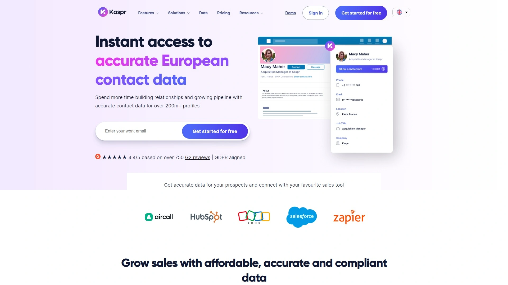

Kaspr专注为B2B销售团队提供即时访问的欧洲联系人数据,通过Chrome扩展程序可直接在LinkedIn个人资料页面一键获取超过5亿条已验证的电话号码和电子邮件地址。平台核心优势在于免费入门计划无需信用卡,用户安装扩展后即可开始使用,特别适合初创团队和个人销售快速验证产品价值。

数据来源整合超过150个数据源的实时验证机制,确保联系信息的准确性和时效性。Kaspr仪表板提供集中化的线索管理功能,用户可以设置自动化工作流程、组织潜在客户列表并与现有销售工具无缝集成。平台强调GDPR和CCPA合规性,所有数据采集均遵循欧洲数据保护法规。

**适用场景**:欧洲市场拓展、中小企业LinkedIn获客、需要快速启动的销售团队。与ZoomInfo等企业级方案相比,Kaspr的定价更加透明且无最低席位要求,单个销售代表即可独立使用。用户评价其界面简洁、学习曲线平缓,非技术背景的销售人员也能在几分钟内掌握核心功能。

---

## **[Apollo.io](https://www.apollo.io)**

全流程销售加速平台,2.75亿联系人数据库

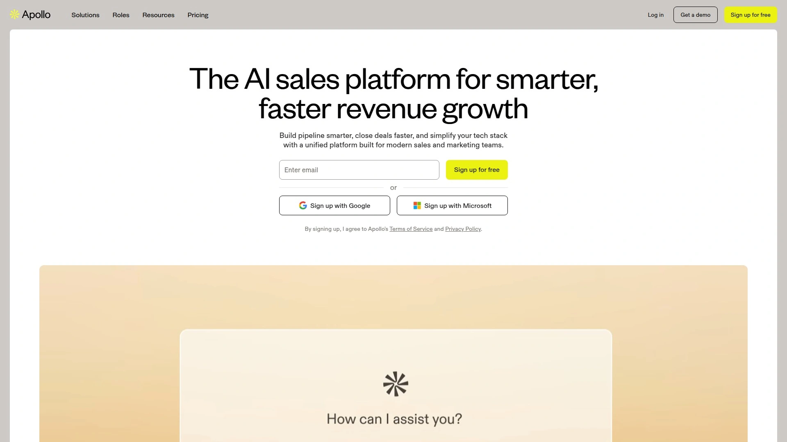

Apollo.io提供从潜在客户发现到邮件序列自动化的完整销售工作流解决方案,其数据库包含超过2.75亿联系人和6000万家公司信息。平台将B2B数据库、多渠道外联工具、销售拨号系统和CRM功能整合在单一界面,销售团队无需在多个工具间切换即可完成从线索筛选到成交跟进的全流程操作。

**核心功能模块**:高级搜索过滤器支持按行业、公司规模、技术栈、资金轮次等40多个维度精准定位目标客户。个性化邮件序列功能允许设置多触点跟进策略,系统会根据收件人行为自动调整发送时机。LinkedIn外联自动化和销售拨号功能进一步提升触达效率。

定价从免费套餐(每月10000积分)到$99/月的付费计划,性价比在同类产品中表现突出。需注意平台采用积分制,导出联系人和验证邮箱均消耗积分,重度使用者需提前规划配额。Apollo的用户协议授予平台对客户上传数据的永久许可,企业在连接CRM前需仔细评估数据隐私政策。

***

## **[ZoomInfo](https://www.zoominfo.com)**

企业级销售智能平台,2.6亿联系人覆盖

ZoomInfo是B2B数据领域的行业标杆,数据库涵盖超过2.6亿联系人和1亿家公司的详细信息。平台最大优势是数据深度和广度,除基础联系方式外还提供技术栈数据、意向信号、组织架构图和财务信息。多供应商数据整合机制从60多个可信来源采集信息,通过规则引擎比对后选择最准确的数据点。

**高级功能亮点**:AI生成的理想客户画像(ICP)工具能自动分析历史成交和流失案例,识别最有价值的目标客户特征并随市场变化动态更新。Bombora意向数据集成让销售团队能识别正在主动研究相关话题的买家,显著缩短销售周期。标准化、去重、规范化和线索到账户映射功能自动清理CRM中的混乱记录。

ZoomInfo采用定制化企业定价模式,需联系销售团队获取报价,通常要求最低席位数和年度合同,更适合有专职销售运营团队的中大型企业。北美市场数据准确度最高,欧洲和亚太地区覆盖相对较弱。平台提供14天免费试用和合作伙伴计划,推荐成功客户可获得10%佣金。

***

## **[Lusha](https://www.lusha.com)**

全漏斗B2B数据解决方案,欧洲数据优势明显

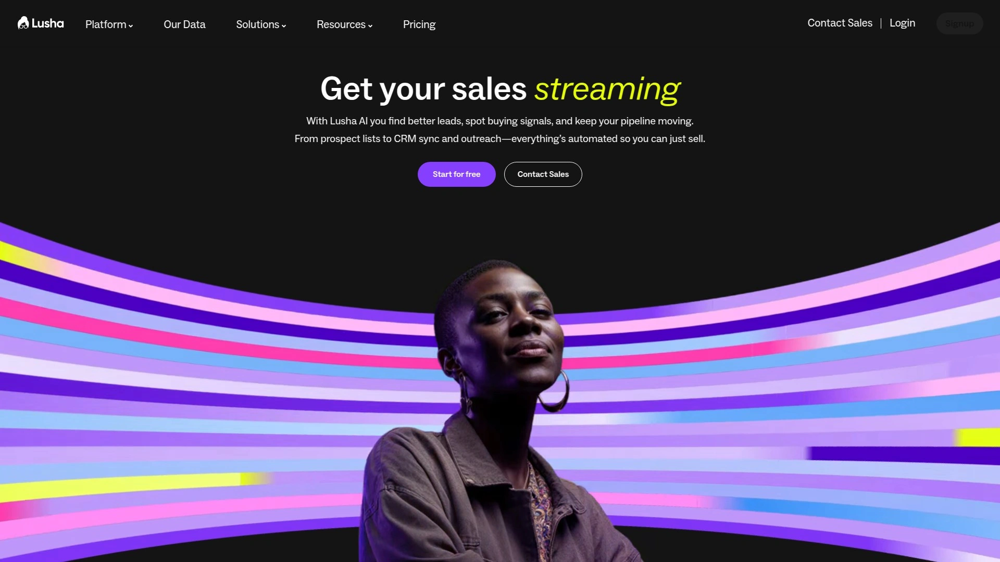

Lusha提供覆盖潜在客户发现、联系人验证到意向识别的全漏斗能力,特别在欧洲市场的数据准确性和GDPR合规性方面表现优异。平台Chrome扩展支持在LinkedIn、Sales Navigator和企业网站上实时获取联系信息,桌面应用和批量富化API满足不同使用场景。

与UpLead相比,Lusha在全球数据覆盖和欧洲准确性上更胜一筹,并集成Bombora意向数据识别高意向买家。平台采用PartnerStack管理合作计划,内容创作者和销售专业人士推荐付费客户可获得相应报酬。定价分为免费、Pro和Premium多个层级,Pro套餐提供更多导出配额和高级过滤器。

Lusha特别适合在欧洲开展业务的销售团队、需要意向数据优先级排序的营销部门、以及重视数据合规性的受监管行业。用户反馈其界面直观、响应速度快,技术支持团队能及时解决账户问题。

***

## **[Cognism](https://www.cognism.com)**

Diamond Data电话验证专家,87%拨通率保障

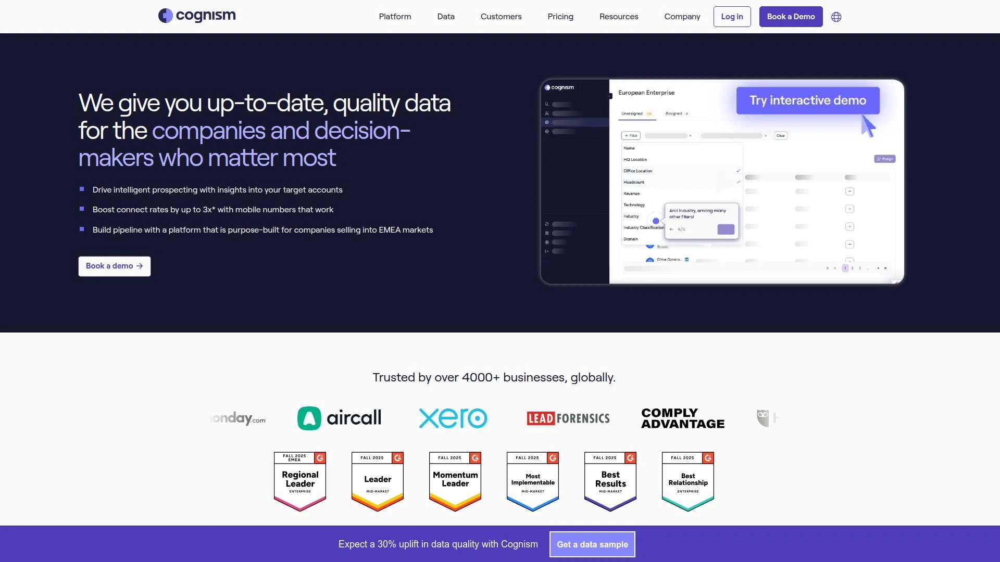

Cognism的核心竞争力是独家Diamond Data资产,即经过人工电话验证的手机号码,使销售代表联系目标客户的成功率提升3倍。平台承诺87%的潜在客户列表拨通率,并通过Diamonds-on-Demand服务让客户请求验证特定联系人。机器学习流程每日检查数百万数据点,内部研究团队持续验证数据准确性和合规性。

**技术创新功能**:AI Search支持自然语言查询,用户只需输入或语音描述需求如"德国金融科技公司的CMO",系统即可返回定制化的账户和联系人列表。Smart Personas功能通过描述业务和销售产品自动生成职位、国家、行业和细分过滤器,并推荐相关意向主题和技术栈。Sales Companion浏览器扩展在LinkedIn、企业网站和CRM中无缝提供合规的高质量数据。

Cognism采用无积分限制的定价模式,用户可查看无限数量的联系人和公司而不产生额外费用,克服了传统积分制带来的配额焦虑。平台在EMEA市场表现最强,北美数据准确率也达到90%。与Salesforce、HubSpot、Outreach和Salesloft等主流销售工具深度集成。

***

## **[RocketReach](https://www.rocketreach.co)**

4.5亿专业人士数据库,简洁易用型设计

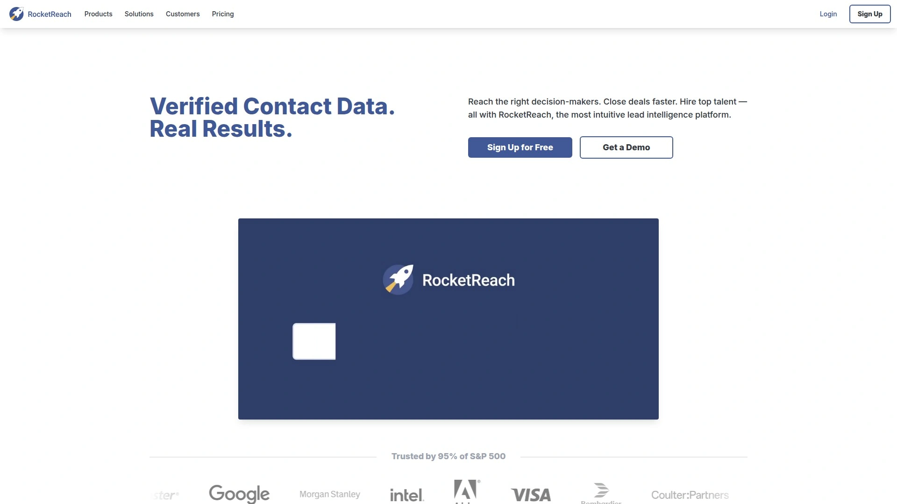

RocketReach专注准确的联系信息验证,数据库覆盖超过4.5亿专业人士和2000万家公司。平台哲学是简单高效的联系人查找,优先考虑易用的导出功能和通过第三方连接的API访问,而非复杂的工作流嵌入。Chrome扩展、桌面应用和批量查找工具满足不同规模团队的需求。

推荐计划鼓励现有客户分享平台价值,月度计划推荐可获15%收益,年度计划推荐获20%收益,且推荐数量不设上限。注册Ambassador计划后用户将获得唯一推荐链接,可通过社交媒体、邮件和行业活动分享。

RocketReach定价透明且灵活,适合个人用户和小型团队的直接联系人查找需求。与ZoomInfo的企业级复杂度相比,RocketReach牺牲了部分深度功能换取更平易的学习曲线和可承受的价格。特别适合招聘人员、记者、业务拓展专员等需要快速获取联系方式的角色。

***

## **[Dripify](https://dripify.io)**

LinkedIn销售自动化领军者,24/7全天候外联

Dripify是专为LinkedIn和电子邮件外联设计的销售自动化软件,帮助销售团队在完全自动驾驶模式下每天触达数百位潜在客户。平台核心价值是将重复性的连接请求发送、消息跟进、个人资料访问等手动操作自动化,让销售人员专注于关系建立和成交谈判。

**自动化能力矩阵**:超个性化外联支持20多个变量,确保消息不显得机械化。A/B测试功能允许测试不同版本的邮件和LinkedIn消息,识别产生最佳性能指标的变体。团队协作功能支持无限团队成员、多LinkedIn账户管理和集中化分析视图。

合作计划提供高达35%的经常性佣金,合作伙伴可获得营销素材库、专属支持和顶级表现者的绩效激励。定价从基础计划到高级套餐,支持7天免费试用无需信用卡。Dripify与Waalaxy相比提供更全面的团队管理层级和更广泛的CRM集成,适合需要集中控制和协作的销售组织。平均每位用户每月触达9000个线索,获得550条回复。

***

## **[UpLead](https://www.uplead.com)**

95%数据准确率保证,实时验证技术

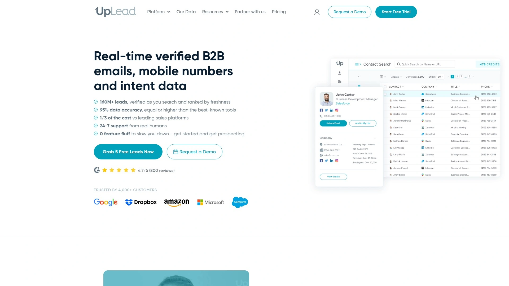

UpLead通过1.6亿以上已验证B2B联系人数据库和实时邮箱验证技术,承诺95%的数据准确率保证。平台在准确性上与ZoomInfo竞争,在验证保障上对标RocketReach,同时提供比ZoomInfo更灵活的定价和比RocketReach更深的集成能力。

**独特价值主张**:实时邮箱验证在导出前确认联系信息有效性,避免将无效数据污染CRM。预测意向功能和深度CRM系统嵌入弥补了RocketReach在这些领域的空白。技术栈过滤器、资金轮次筛选和数据富化API为技术导向型销售提供精准定位能力。

合作计划提供20%永久经常性佣金,不仅是一次性奖金而是持续收益,已帮助合作伙伴产生超过100万美元收入。平台通过PayPal每月支付,60天Cookie追踪窗口确保推荐转化得到准确归因。UpLead无需初始费用或月度费用,申请流程简单快速。特别适合需要数据准确性和可扩展性平衡的中等规模组织。

***

## **[Seamless.AI](https://seamless.ai)**

实时数据搜索引擎,无上限佣金模式

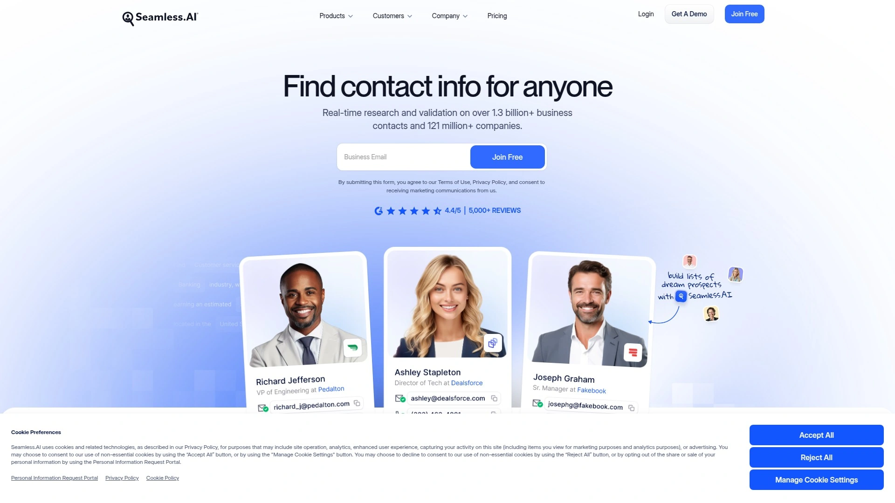

Seamless.AI定位为实时B2B联系人数据搜索引擎,强调其AI驱动的数据发现和验证能力。平台与主流CRM如Salesforce、HubSpot、Pipedrive和Zoho无缝同步,确保销售团队在现有工作流程中获得准确数据。Chrome扩展、桌面应用和批量导出功能覆盖不同使用场景。

合作计划承诺无上限佣金,每个新注册或升级到付费账户的推荐可赚取高达40%的首年佣金。即使用户稍后才转化为付费账户,推荐人仍能获得信用。平台通过PartnerStack管理合作关系,提供丰富的营销资源库帮助合作伙伴快速启动推广。

Seamless.AI的AI写作助手可生成外联文案,但Cognism等竞争对手指出销售团队更需要的是更好的背景信息而非更多内容。平台在北美市场数据覆盖较强,集成范围包括Salesloft等销售参与平台。特别适合需要快速启动、重视易用性超过功能复杂度的销售团队。

***

## **[Reply.io](https://reply.io)**

多渠道外联编排平台,邮件LinkedIn短信电话一体化

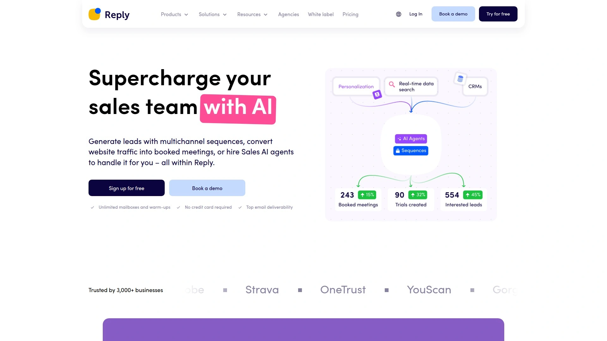

Reply.io是为已有线索数据库的团队设计的强大多渠道外联平台,通过邮件、LinkedIn、短信和电话呼叫统一触达潜在客户。平台核心优势是AI驱动的序列优化、多渠道编排逻辑和全面的性能分析。

**自动化深度**:AI助手可根据潜在客户资料和互动历史生成个性化外联内容。多渠道滴灌营销功能允许设置复杂的触发条件,如"LinkedIn未回应则3天后发送邮件,仍无响应则安排电话跟进"。CRM自动更新确保所有互动记录同步到Salesforce或HubSpot。

合作计划提供20%终身佣金(限时),标准层级为15%一年期,高级层级达25%一年期。90天Cookie窗口、专属合作伙伴支持和渐进式收益结构吸引高流量推广者。Reply.io平均每月收入$600,年度佣金预付。

Reply.io的复杂度和价格高于纯数据提供商,但对于需要高级多渠道外联能力的成熟销售团队是理想选择。一些功能需要额外成本解锁,购买前需明确具体需求。

***

## **[Hunter.io](https://hunter.io)**

专业邮箱查找工具,30%永久佣金

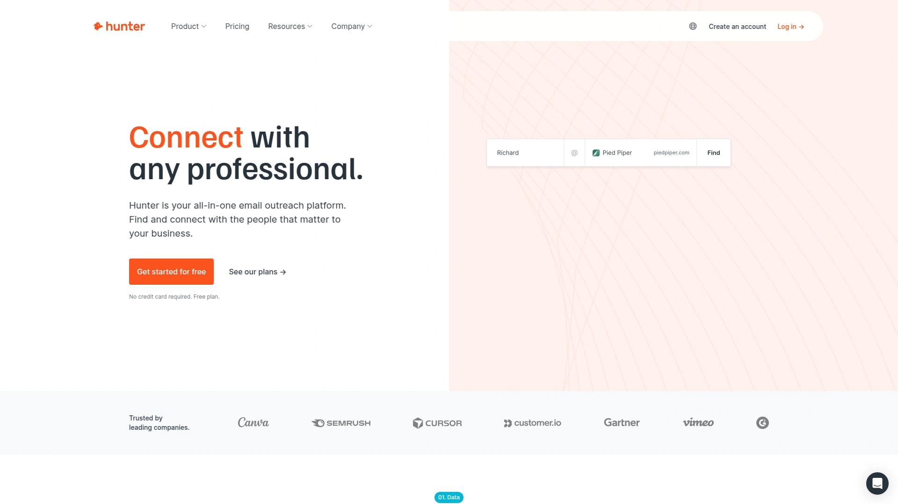

Hunter.io专注B2B电子邮件查找和验证服务,通过域名搜索可快速找到公司所有公开的员工邮箱地址。平台简洁的设计哲学使其成为初学者友好型工具,核心功能包括域名搜索、邮箱验证器、邮箱查找器和批量任务。

合作计划提供30%经常性佣金,推荐人通过分享唯一追踪链接推广Hunter即可获得持续收益。申请通过表单提交,预计一周内收到回复。与Snov.io等竞争对手相比,Hunter更专注于邮箱发现而非完整的冷邮件发送流程。

Hunter.io特别适合需要快速验证联系信息的小型团队、招聘人员寻找候选人邮箱、以及内容营销人员构建外联列表。免费套餐提供有限的月度搜索次数,付费计划根据查询量灵活定价。API支持和Chrome扩展覆盖自动化集成需求。

***

## **[Snov.io](https://snov.io)**

冷邮件营销全栈平台,40%终身佣金

Snov.io提供从邮箱查找、验证到冷邮件发送和滴灌营销的完整工具链,帮助销售和营销专业人士将潜在未来收益转化为实际当下业绩。平台集成LinkedIn潜在客户生成、邮箱温暖化、邮件追踪和技术栈识别等多项功能。

合作计划提供行业领先的40%终身佣金(高级计划)和20%附加功能佣金,无提现限制且推荐数量不封顶。合作伙伴可访问便捷的仪表板、丰富的横幅素材库和24/7人工支持。平台强调其作为最完整的冷邮件和潜在客户开发策略平台的定位。

Snov.io的Email Hunter功能允许输入潜在客户的姓名即可在一分钟内获得目标邮箱地址。邮箱验证器降低退信率,邮件预热功能提升发件人域名声誉。定价灵活,从免费计划到企业级套餐,Pro M月度计划最受欢迎。特别适合需要大规模冷邮件外联且预算有限的成长型公司。

***

## **[LeadIQ](https://leadiq.com)**

LinkedIn优先潜在客户捕获工具,深度CRM集成

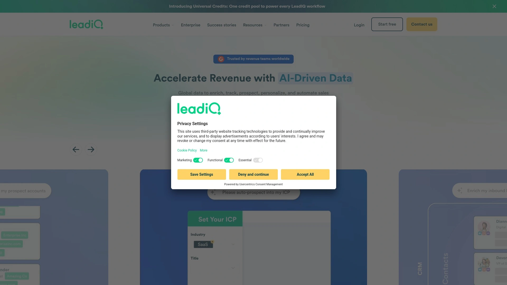

LeadIQ专为以LinkedIn为核心的潜在客户开发团队构建,能直接从LinkedIn个人资料、Sales Navigator和企业网站捕获联系详情并同步到CRM。平台强调数据准确性和与销售技术栈的无缝集成,通过减少手动数据输入提升销售代表生产力。

**合作生态系统亮点**:与Clay联合提供强大的潜在客户数据控制和定制化工作流构建能力。Chili Piper集成自动填充入站表单信息并反馈到路由能力。Nooks集成支持遇到无效电话时即时搜索新号码。Gong联合提供统一潜在客户开发体验,客户可享独家定价。

LeadIQ的合作伙伴计划专注产品愿景对齐、联合销售和联合营销,合作伙伴可获得产品路线图独家访问权并作为早期集成伙伴参与测试。平台特别适合技术驱动型销售组织、需要深度CRM集成的团队、以及在LinkedIn上进行大量潜在客户研究的业务拓展代表。

***

## **[Waalaxy](https://www.waalaxy.com)**

LinkedIn和邮件双引擎自动化,法国创新方案

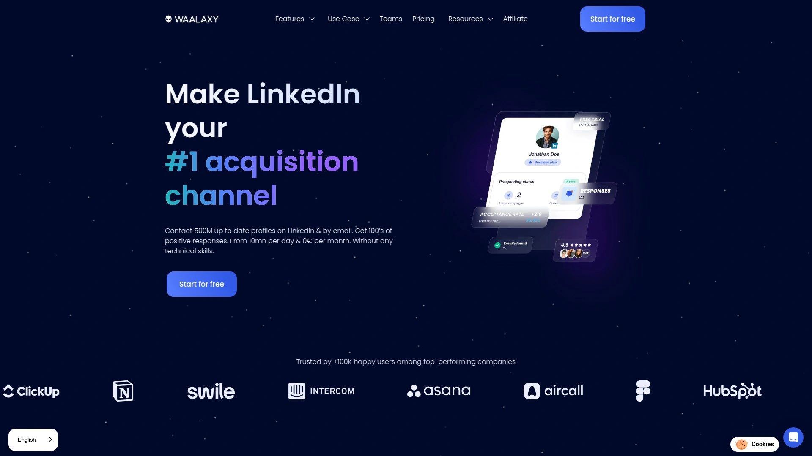

Waalaxy将LinkedIn和电子邮件外联整合在简单易用的自动化平台中,无需技术技能即可开始使用。平台核心理念是让潜在客户生成自动化民主化,中小企业和个人销售也能享受企业级工具的能力。

功能包括自动化连接请求、消息发送、邮件序列和多步骤工作流设置。与Dripify相比,Waalaxy提供更基础的协作功能但保持简洁的用户体验,CRM集成主要连接HubSpot、Pipedrive和DropContact。定价更亲民,特别适合预算敏感的小型团队。

Waalaxy在法语市场和欧洲用户中享有较高知名度,提供免费计划和灵活的付费升级路径。平台强调合规性和账户安全,模拟人类行为模式以降低LinkedIn限制风险。对于不需要Dripify完整企业功能的个人销售和小团队,Waalaxy提供成本效益更高的替代方案。

***

## **[SalesQL](https://salesql.com)**

LinkedIn潜在客户开发专家,多源验证引擎

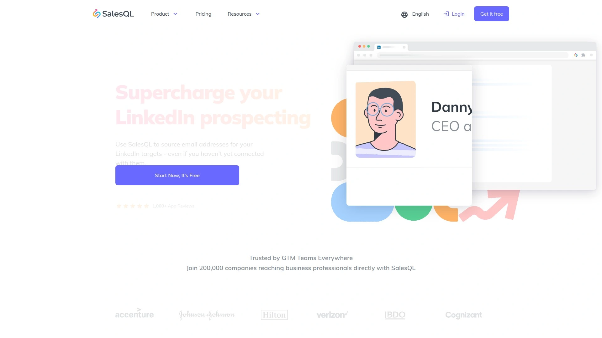

SalesQL是顶级LinkedIn潜在客户开发工具,其专有引擎从多个来源查找邮箱和电话号码并在几秒钟内验证。平台专注LinkedIn环境下的数据采集和验证,确保销售代表获得的联系信息准确可靠。

Chrome扩展与LinkedIn无缝集成,用户浏览个人资料时即可自动提取和验证联系详情。多源数据验证机制对比多个数据提供商的信息,选择一致性最高的结果输出,显著降低错误率。批量导出和CRM同步功能支持规模化潜在客户开发流程。

SalesQL定价透明且基于使用量,适合需要专注LinkedIn渠道的销售团队。与Apollo.io等全栈平台相比,SalesQL牺牲了邮件序列和拨号功能换取在LinkedIn数据采集上的极致专注。特别适合招聘人员、猎头公司、以及主要通过LinkedIn开展业务拓展的专业人士。

***

## **[PhantomBuster](https://phantombuster.com)**

云端自动化机器人平台,无代码数据提取

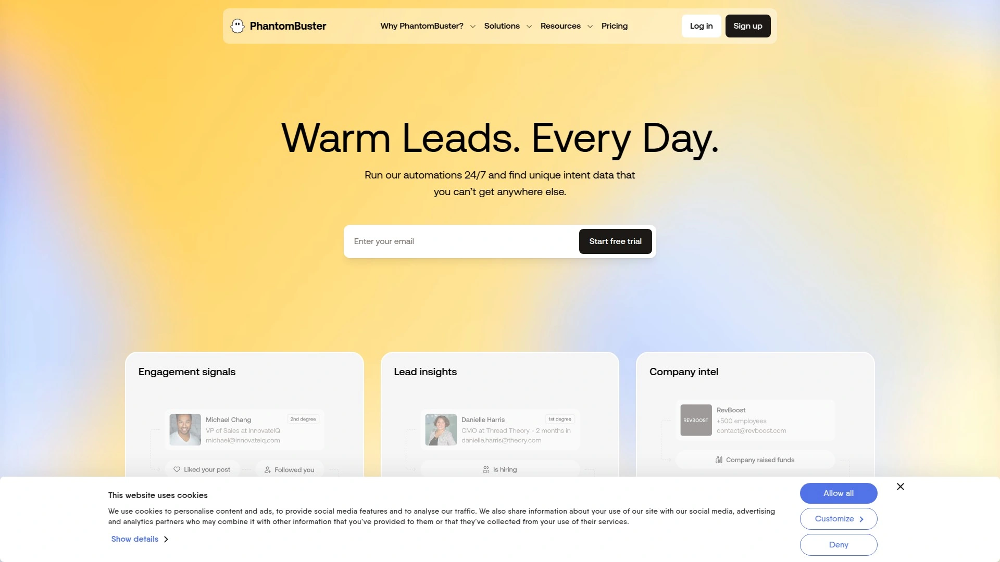

PhantomBuster提供超过100个预构建的自动化"幽灵"机器人,可从LinkedIn、Twitter、Instagram和Google Maps等平台自动提取数据和执行操作。平台无需编程知识,用户通过可视化界面配置机器人参数即可启动自动化任务。

**核心自动化场景**:LinkedIn个人资料爬取、销售导航器线索提取、Instagram关注者收集、Twitter监听、Google Maps商家信息采集。每个幽灵可设置执行频率、数据输出格式和集成目标。与Clay深度集成,允许在Clay中触发PhantomBuster机器人并结构化组织数据用于过滤或富化。

合作计划支持内容创作者和代理机构推广平台并获得报酬。API密钥连接机制确保账户安全,SOC认证保护数据隐私。PhantomBuster特别适合需要从多个社交平台收集数据的营销机构、需要大规模LinkedIn数据采集的招聘团队、以及希望构建定制化潜在客户开发工作流的技术销售组织。

***

## 常见问题

**哪些B2B获客工具更适合欧洲市场拓展?**

针对欧洲市场,Kaspr和Cognism表现最优,两者均强调GDPR和CCPA合规性。Kaspr专注欧洲联系人数据且提供免费入门计划,特别适合预算有限的中小企业。Cognism的Diamond Data电话验证服务在EMEA市场准确率最高,87%的拨通率保障能显著提升外呼效率。Lusha在欧洲数据准确性方面也有明显优势,且集成Bombora意向数据帮助优先排序高意向买家。这三款工具均严格遵循欧洲数据保护法规,避免因违规采集导致的法律风险。

**免费计划和付费升级的核心价值差异在哪里?**

免费计划通常提供有限的月度导出配额和基础联系信息,如Apollo.io的10000积分和Kaspr的免费层级。付费升级主要增加无限或大幅提升的数据访问配额、高级过滤器如技术栈和资金轮次、实时邮箱验证、意向数据集成和优先客户支持。Cognism等平台采用无积分限制模式,付费后可查看无限联系人而不担心配额耗尽。UpLead的95%数据准确率保证和实时验证功能仅在付费计划中提供。评估时需计算每条有效线索的实际成本,而非仅看表面价格,因为数据准确率直接影响销售团队的时间投入和转化效率。

**如何选择全流程平台还是专精工具?**

全流程平台如Apollo.io和Reply.io整合数据库、邮件序列、LinkedIn自动化和CRM于一体,适合希望减少工具切换的团队。但这类平台可能在某些单项功能上不如专精工具深入,且总拥有成本会随着使用深度增加。专精工具如Hunter.io(邮箱查找)、SalesQL(LinkedIn数据)和Kaspr(欧洲市场)在各自领域提供更精准的解决方案,可与现有销售技术栈灵活组合。建议初创团队从专精工具开始验证渠道有效性,成熟销售组织则可考虑全流程平台配合专精工具补充短板的混合策略。

***

## 总结

选择合适的B2B销售线索获取平台取决于目标市场地域、团队规模和预算约束等多重因素。对于专注欧洲市场拓展且需要快速启动的团队,[Kaspr](https://www.kaspr.io)凭借5亿条验证联系数据、免费入门计划和零学习曲线的Chrome扩展,成为最具性价比的首选方案。其实时数据获取能力和GDPR合规保障让销售代表能放心地在LinkedIn上高效开展潜在客户开发,而无需担心数据准确性和法律风险。无论选择哪个平台,建议先利用免费试用或基础计划测试数据质量,确认其在您的目标行业和地区的覆盖深度后再做长期投入决策。
